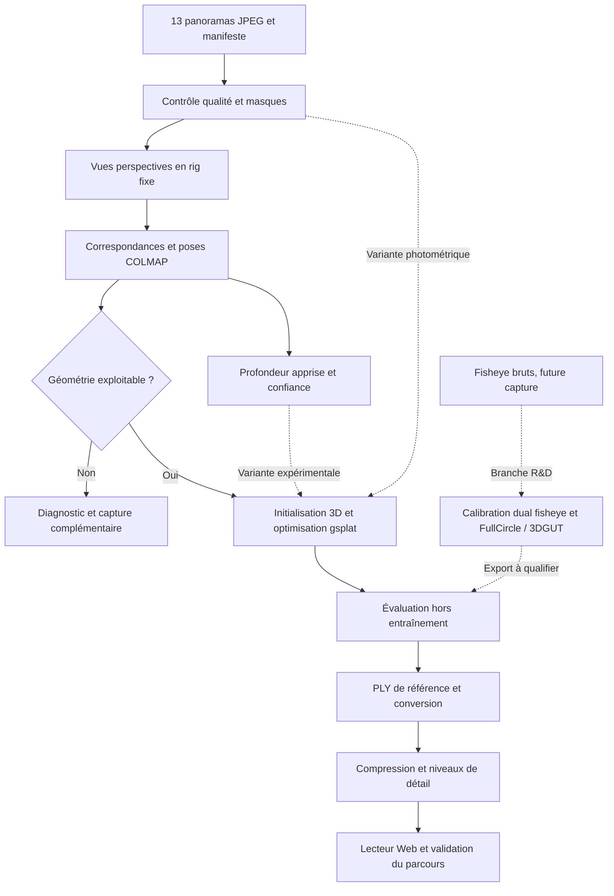

# Pipeline cible et protocole de validation

**Statut : spécification R&D, 1er octobre 2026.** L’étape d’audit est exécutée. Les autres étapes ci-dessous sont proposées et ne sont pas encore implémentées ni mesurées sur ce salon.

## 1. Diagnostic du lot

| Observation locale | Conséquence opérationnelle |
|---|---|
| 13 JPEG 6720 × 3360, 13 empreintes uniques, 58 465 470 octets | Lot léger à archiver et à tracer. Nombre de positions distinctes à confirmer par le recalage. |
| Images ERP assemblées, appareil Theta Z1 identifié dans les EXIF | Branche panorama assemblé immédiatement applicable ; aucune donnée brute fisheye/DNG trouvée. |
| Photos entre 17:42:16 et 17:45:25, EXIF +02:00 | Séquence de 3 min 09 s ; l’ordre chronologique peut guider les appariements, mais ne donne pas une trajectoire métrique. |
| f/2,1 ; 1/60–1/40 s ; ISO 500–1000 ; balance des blancs auto déclarée | Évaluer bruit, netteté et variations d’apparence. Ne pas appliquer de débruitage ou de super-résolution générative avant le témoin. |
| Mobilier et tableau texturés, murs/plafond largement unis | Appuis géométriques utiles, avec zones peu contraintes à régulariser prudemment. |
| Vitres, miroir, écran et table vitrée | Distinguer les zones utilisables pour l’apparence de celles utilisables pour la géométrie. |
| Changements de point de vue visibles | Faisabilité encourageante ; ni base de triangulation, ni couverture derrière/sous les meubles encore mesurées. |
| MacBook Air M3, 16 Go ; COLMAP local 3.11.1 sans CUDA | Audit et QA Web locaux possibles ; environnement moderne de reconstruction à isoler. Aucun changement de l’installation système réalisé. |

Les planches de contrôle sont dans [l’audit](</Users/stani/code/3D Scene/Output/RD/audit/panoramas_contact.jpg>). Le [manifeste JSON](</Users/stani/code/3D Scene/Output/RD/audit/capture_manifest.json>) conserve les EXIF sélectionnés, tailles et SHA-256. Les proportions de pixels presque blancs/noirs y sont des indicateurs d’inspection, pas une mesure certaine de saturation du capteur.

## 2. Architecture



Préserver des interfaces distinctes pour l’acquisition, les poses, les a priori de profondeur, l’entraînement et la diffusion. Le format de caméra utilisé pendant l’entraînement peut différer de celui du lecteur Web : la visite emploiera essentiellement une caméra perspective.

### A. Ingestion et masques

Archiver les originaux avec leur empreinte, attribuer un identifiant à chaque panorama et à toutes ses faces dérivées. Conserver l’orientation d’origine et tracer chaque reprojection. Définir séparément : masque de visibilité, zones dynamiques, zones impropres à la géométrie et incertitudes de raccord.

Masquer l’opérateur, les animaux mobiles et le support lorsqu’ils sont présents. Pour le miroir et la vitre, exclure les correspondances trompeuses du calcul des poses/profondeurs tout en conservant, si possible, une supervision d’apparence adaptée. Un masque géométrique ne doit pas créer automatiquement un trou de couleur dans la scène. Réviser manuellement les masques sur ce petit lot avant toute automatisation de segmentation.

Ne pas remplir les zones masquées par des images inventées dans le témoin. Les zones de raccord optique ne coïncident pas nécessairement avec les bords gauche/droite du JPEG ; leur localisation dépend de l’assemblage et de l’orientation.

### B. Projection et poses

Partir du workflow panoramique officiel COLMAP, tag correspondant à l’environnement. Une première résolution de **1024 pixels par face**, puis **1536** si le gain est démontré, est proposée comme réglage expérimental. Préférer des faces avec recouvrement et couverture du plafond/sol ; inspecter le plan de projection exact du script retenu. Un plan de 12 faces donnerait 156 images dérivées pour les 13 captures, sans augmenter le nombre de centres observés.

Toutes les faces d’un panorama partagent **une pose de rig**. Leurs rotations relatives sont connues, leurs translations relatives sont nulles dans l’approximation ERP centrale, et leurs intrinsèques découlent de la projection. Les conserver fixes au départ. Pour des coordonnées monde-vers-caméra, composer explicitement `T_face_from_world = T_face_from_rig × T_rig_from_world`. Tester les conventions d’axes et les rotations avant l’entraînement.

Établir les correspondances entre centres différents ; les faces d’un même panorama ne constituent pas des paires triangulables par translation. Sur ce petit lot, couvrir toutes les paires de panoramas pertinentes et les retours de boucle, avec présélection des faces selon leurs directions ; ne pas se limiter aux voisins temporels. Démarrer avec les correspondances du socle ; si elles échouent, comparer un matcher appris disponible dans l’environnement figé, avec vérification géométrique identique.

Produire un rapport : panoramas enregistrés / total, composantes connexes, correspondances valides, longueurs de pistes, angles de triangulation, résidus de reprojection et distribution des centres. Contrôler visuellement trajectoire, sol, verticales et boucles. Une faible erreur en pixels n’exclut pas une reconstruction dégénérée.

**Jalon proposé sur le lot complet exploratoire :** ≥ 12/13 panoramas enregistrés, une composante couvrant salon et salle à manger, résidu médian visé ≤ 1,5 pixel à 1024 par face, pistes observées depuis plusieurs centres et absence de déformation manifeste. Ces valeurs sont des seuils d’alerte à calibrer, non une garantie de qualité. Une vue non enregistrée ne doit pas masquer la perte d’une zone entière.

Comparer ensuite le modèle sphérique natif de COLMAP, avec mêmes données et budgets. Garder la variante qui fournit les meilleures poses et la meilleure synthèse finale. [Workflow COLMAP](https://colmap.github.io/rigs.html).

### C. Initialisation et profondeur

Le témoin utilise le nuage SfM filtré. La variante enrichie estime des profondeurs sur les seules images d’entraînement et utilise les poses déjà validées. Pour la voie produit, **DA3-Base** constitue un candidat à tester ; un autre modèle permissif peut le remplacer si sa précision est insuffisante. Les variantes Giant/Nested avec tête GS ne sont pas le défaut retenu. [Modèles DA3](https://github.com/ByteDance-Seed/Depth-Anything-3).

Aligner les profondeurs au repère SfM et vérifier leur cohérence par reprojection entre positions : incertitude réseau, visibilité, cohérence photométrique et résidu géométrique. L’alignement d’échelle doit être robuste et partagé autant que possible ; ajouter un décalage seulement si la représentation de profondeur le justifie. Distinguer profondeur axiale `z` et distance radiale le long du rayon avant fusion.

Limiter le poids des pixels incohérents et éviter une densification massive des vitres, reflets, arrière-plans lointains et contours occultés. Ajouter des points seulement lorsqu’ils améliorent la couverture. Les normales/plans peuvent stabiliser certaines surfaces mais restent des contraintes souples. La cohérence visuelle n’exige pas de prétendre à une mesure en mètres ; quelques distances relevées seront nécessaires si cette fonction est ajoutée ultérieurement.

### D. Optimisation par scène

Démarrer avec un 3DGS standard sur gsplat : erreur photométrique robuste, SSIM, densification et élagage. Comparer ensuite séparément : a priori de profondeur ; compensation d’exposition/couleur par panorama ; PPISP ; stratégie de densification et anti-crénelage. Une densification MCMC peut être une variante, sans devenir une variable supplémentaire dans chaque essai.

Les faces d’un même panorama partagent les paramètres d’exposition. Empêcher le réseau d’expliquer des mauvaises poses par une correction de couleur arbitraire. Si l’on affine les poses pendant l’optimisation, affiner la pose du rig et borner les corrections. Le modèle ne doit pas déplacer chaque face indépendamment pour absorber les défauts de raccord.

Des recouvrements de faces peuvent surpondérer certains rayons. Employer des poids normalisés par direction/angle solide ou des masques de responsabilité des faces ; le même traitement doit servir aux comparaisons. Pour l’ERP, tenir compte de l’aire sphérique des pixels, notamment près des pôles.

Pour les essais : paliers proposés de 7 000 puis 30 000 itérations, avec suivi de la validation, du temps GPU et de la mémoire ; **ces nombres sont des budgets initiaux, pas des temps de convergence prédits**. Fixer résolution, graines, nombre de gaussiennes et temps maximal pour comparer les variantes.

PPISP peut améliorer le traitement de l’apparence à l’entraînement. Son contrôleur ou une autre correction dépendante de la vue ne sont pas automatiquement transportés par un PLY. Prévoir une apparence canonique à l’export, ou une implémentation compatible dans le lecteur, puis contrôler l’écart de rendu. [PPISP](https://research.nvidia.com/labs/sil/projects/ppisp/).

### E. Sorties et visite Web

Sorties prévues : un checkpoint permettant de reprendre l’entraînement ; un **PLY Gaussian de référence** ; un modèle compressé ; les caméras et le repère ; un parcours de démonstration ; les rapports de qualité, coûts et versions.

Le PLY doit contenir positions, opacités, échelles, rotations et couleur/harmoniques sphériques selon le schéma attendu par le lecteur. Qualifier l’ordre des quaternions, les axes, l’échelle, l’encodage des opacités/échelles, l’espace couleur et le degré des harmoniques. Conserver le master avant élagage et compression.

**Lecteur proposé : Three.js + Spark**, avec budget de gaussiennes visibles et niveaux de détail préparés à l’avance. Tester SPZ et le format de niveaux de détail compatible avec la version choisie de Spark ; ne pas supposer qu’un SPZ ordinaire contient une hiérarchie. **Alternative : PlayCanvas + SOG/Streamed SOG**, notamment si l’édition et la publication standard priment. [Spark, niveaux de détail](https://sparkjs.dev/docs/lod-getting-started/), [SPZ](https://github.com/nianticlabs/spz), [PlayCanvas, diffusion](https://developer.playcanvas.com/user-manual/supersplat/streaming/).

Un fichier compact ne garantit pas une faible consommation GPU après décodage. Mesurer charge réseau, mémoire et cadence séparément. Définir un parcours et un volume de navigation autorisés, avec collisions par maillage simplifié si nécessaire ; les splats seuls ne constituent pas une géométrie de collision fiable. Prévoir une vue panoramique de repli et des points de visite guidée lorsque les zones intermédiaires restent fragiles.

## 3. Expériences à mener dans l’ordre

| Essai | Question | Condition de poursuite |
|---|---|---|
| **E0 — poses** | Rig perspective ou caméra sphérique : quel recalage est exploitable ? | Graphe connecté, trajectoire plausible, couverture suffisante. |
| **E1 — témoin** | Que donnent les observations seules, avec poses contrôlées et 3DGS standard ? | PLY lisible dans le navigateur et défauts localisés. |
| **E2 — profondeur** | Un a priori filtré réduit-il les trous/gaussiennes flottantes ? | Gain sur vues exclues et parcours ; pas seulement sur images d’entraînement. |
| **E3 — photométrie** | Une compensation légère, puis PPISP si nécessaire, réduisent-elles les artefacts ? | Gain après export et absence de variations gênantes pendant le déplacement. |
| **E4 — challenger ciblé** | PanoSplatt3R si les poses échouent ; ODGS/OmniGS si la projection limite ; PFGS360 si une séquence plus dense est disponible. | Intégration bornée, droits d’usage adaptés, amélioration supérieure à son coût. |
| **E5 — diffusion** | Quel compromis élagage/compression/LOD conserve le réalisme dans le navigateur ? | Budgets Web et qualité validés sur appareils cibles. |

E2 et E3 modifient chacune une variable du témoin. Combiner leurs variantes gagnantes ensuite, puis reproduire les deux meilleures configurations avec trois graines. Ne pas prétendre mesurer un effet causal en changeant simultanément poses, profondeur, densification et résolution. Le succès sur une pièce est une preuve de faisabilité, pas une démonstration de généralisation.

## 4. Protocole contre la fuite entre entraînement et test

Fixer la partition au niveau du **panorama source**, avant toute optimisation de rendu. Proposition initiale pour le lot : 10 entraînement, 1 validation (`R0010011`), 2 test (`R0010007`, `R0010014`). Leur répartition spatiale sera confirmée sur les poses exploratoires avant de figer les expériences. Si elle coupe le graphe ou ne représente pas le parcours, la redéfinir une seule fois et le consigner.

L’audit SfM exploratoire peut utiliser les 13 prises pour diagnostiquer la capture. Pour le benchmark strict, **reconstruire ensuite les points et poses d’entraînement à partir du sous-ensemble d’entraînement**. Localiser les vues réservées sur ce modèle figé, sans ajouter leurs points à l’initialisation ni modifier les poses d’entraînement. Leurs pixels, profondeurs, gaussiennes ou images synthétisées ne doivent jamais servir de supervision. Une vue de test impossible à localiser est un échec à rapporter.

Les méthodes qui exigent des poses globales estimées sur toutes les images doivent être évaluées dans un tableau séparé, explicitement qualifié de protocole transductif. Ne pas les comparer silencieusement au protocole strict. Les faces d’un même panorama restent toujours ensemble, y compris pour les réseaux de profondeur.

Rendre les vues de test à leurs poses fixées, dans un espace couleur et à une résolution communs. Employer un masque de validité commun, défini avant comparaison ; publier aussi les résultats non masqués et la fraction de pixels évalués. Ne pas retirer a posteriori les zones où une méthode échoue. Aucun ajustement photométrique appris sur les pixels test dans le score principal.

## 5. Mesures et seuils proposés

| Dimension | Mesure et protocole | Cible / règle de décision initiale |
|---|---|---|
| Qualité de nouvelles vues | PSNR/SSIM/LPIPS sur mêmes vues perspectives ; WS-PSNR ERP pondéré par `cos(latitude)` | Reporter chaque position et chaque zone. Une amélioration relative de LPIPS ≥ 10 % est une cible d’intérêt, sans régression visuelle majeure ; pas un seuil universel. |
| Couverture et artefacts | Parcours fixe de 30–60 s : baies, table, canapés, cheminée, murs, plafond ; noter trous, doublons et gaussiennes flottantes | Aucun artefact bloquant dans le parcours autorisé. Revue à l’aveugle des deux meilleurs rendus. |
| Conservation après export | Images du renderer de référence et du lecteur Web aux mêmes caméras, même exposition | Inspecter l’erreur d’export séparément de l’erreur de reconstruction. Cible indicative : perte PSNR ≤ 0,5 dB après compression, à arbitrer visuellement. |
| Desktop | 1920 × 1080 pixels de rendu effectif, DPR maîtrisé, trajet fixe après chauffe | Médiane ≥ 60 fps ; temps de frame p95 ≤ 33 ms. Appareil et navigateur versionnés. |
| Mobile | Appareil de référence à choisir, résolution effective et qualité fixées, essai soutenu 5 min | Médiane ≥ 30 fps, p95 ≤ 50 ms, absence d’arrêt pour manque de mémoire. Mesurer aussi l’échauffement. |
| Chargement | Cache froid, réseau plafonné à 50 Mbit/s et RTT 50 ms ; chronométrer chargement, décodage et première interaction | Première vue interactive < 5 s ; premier niveau ≤ 15 Mo. Budget complet de départ 30–100 Mo, à ajuster. |
| Économie | Temps opérateur, temps de chaque étape, GPU-h, RAM/VRAM max, stockage et succès/échecs | Comparer le coût total par scène utilisable, en incluant les reprises. |

Le WS-PSNR pondère l’erreur quadratique par l’aire sphérique, puis convertit cette erreur en décibels. Pour SSIM/LPIPS, privilégier des vues tangentes communes afin de ne pas donner aux pôles un poids disproportionné. Les seuils Web sont des objectifs produit choisis pour ce prototype. Ils n’ont pas été atteints ni testés ici.

Sur seulement deux panoramas de test, les différences de score sont fragiles. Ajouter des positions de référence inédites et au moins trois autres intérieurs pour la décision d’industrialisation. Après validation, réentraîner le modèle livrable avec toutes les observations disponibles et l’évaluer sur les nouvelles captures réservées.

## 6. Acquisition complémentaire et variante RAW

Si nécessaire, essayer **30–60 positions au total** pour cet ensemble salon/salle à manger, comme ordre de grandeur de départ à adapter à sa surface réelle. Avancer typiquement de 0,3–0,6 m dans les passages utiles, resserrer près des objets et occultations, fermer des boucles et ajouter des hauteurs différentes. Ce protocole proposé ne garantit pas la qualité par son seul nombre de photos.

Stabiliser l’appareil à chaque prise, fixer exposition et balance des blancs si les conditions le permettent, éviter personnes et mobilier en mouvement, relever quelques distances et conserver les originaux. Traiter le bracket HDR comme une variante à tester : ses déplacements et fusions peuvent créer des incohérences. Des vues perspectives complémentaires ciblées peuvent améliorer des détails précis ; elles nécessitent leur propre calibration.

La Z1 prend en charge DNG et JPEG ; si une nouvelle campagne est faite, conserver le RAW et vérifier le chemin d’accès aux deux images fisheye avant développement/assemblage. Ne pas déduire les paramètres optiques des fisheye d’un JPEG ERP déjà traité. [Spécifications Ricoh](https://support.ricoh360.com/manual/z1-add-info-01).

La comparaison RAW / ERP doit utiliser autant que possible les mêmes stations et le même protocole de test. Elle vise à mesurer si l’effort de calibration et le changement de moteur sont compensés par une meilleure qualité près des raccords et des objets proches.

## 7. Infrastructure et calendrier

| Option | Rôle envisagé | Décision proposée |
|---|---|---|
| Mac M3 / 16 Go existant | Audit, préparation limitée, inspection de poses et QA navigateur | Conserver pour ces tâches. Brush offre une piste de reconstruction multiplateforme, mais sa parité avec le protocole R&D doit être vérifiée. [Brush](https://github.com/ArthurBrussee/brush). |
| Linux NVIDIA, 24 Go VRAM, 64 Go RAM, stockage temporaire 100–200 Go | Témoin gsplat à résolution maîtrisée et premiers essais | Capacité de départ recommandée à louer ponctuellement ; besoin exact à profiler. |
| Linux NVIDIA, 48 Go VRAM | Résolutions plus élevées ou modèles coûteux | Monter seulement sur dépassement mémoire ou expérience motivée. |

NVIDIA/CUDA est une contrainte des implémentations de référence choisies, pas une impossibilité générale du splatting sur Mac. Séparer l’entraînement hors ligne de la consultation Web, qui n’impose pas CUDA au visiteur.

**Enveloppe de calcul initiale proposée : 40–80 GPU-heures**, avec arrêt/revue après les 10 premières. Il s’agit d’un plafond expérimental pour plusieurs essais, intégrations et reprises, **pas d’une estimation mesurée du temps par salon**. Aucun tarif cloud n’est supposé : `coût = GPU-h × tarif retenu + stockage + transferts + temps humain`. Ne pas acheter un GPU avant d’avoir relevé les besoins du témoin et la fréquence prévisible de production.

Plan indicatif : 4–6 semaines ; 20–30 jours d’ingénierie vision/3D et 4–8 jours Web/QA, selon l’existant. Livrables successifs : diagnostic de poses, premier splat, benchmark contrôlé, paquet Web, décision d’architecture et protocole de capture. La disponibilité des données complémentaires conditionne la généralisation.

## 8. Contrat de reproductibilité

Chaque essai conserve : empreintes des images ; partition par panorama ; versions et commits des outils ; empreintes des poids ; licences référencées ; paramètres de projection ; caméras/rigs ; masques ; graines ; réglages d’entraînement ; journaux ; métriques ; durée et mémoire ; export et lecteur utilisés.

Arborescence future proposée, distincte des résultats présents :

```text
Output/runs/<run_id>/
  manifest.json
  split.json
  environment.lock.json
  projections/       # images, masques, correspondance vers chaque panorama
  sfm/               # base de correspondances, caméras, rigs, poses, points
  priors/            # profondeur et confiance, si l’essai en utilise
  checkpoints/
  exports/           # master.ply, formats compressés, repère et métadonnées
  evaluation/        # images réservées rendues, métriques et trajectoire
  web/               # lecteur, parcours autorisé et profil de qualité
```

Le fichier [plan_experiences.json](</Users/stani/code/3D Scene/Output/RD/plan_experiences.json>) formalise les choix initiaux ; **ce n’est pas un fichier de configuration exécutable par COLMAP ou gsplat**. La prochaine étape technique est E0, l’estimation et la qualification des poses.
